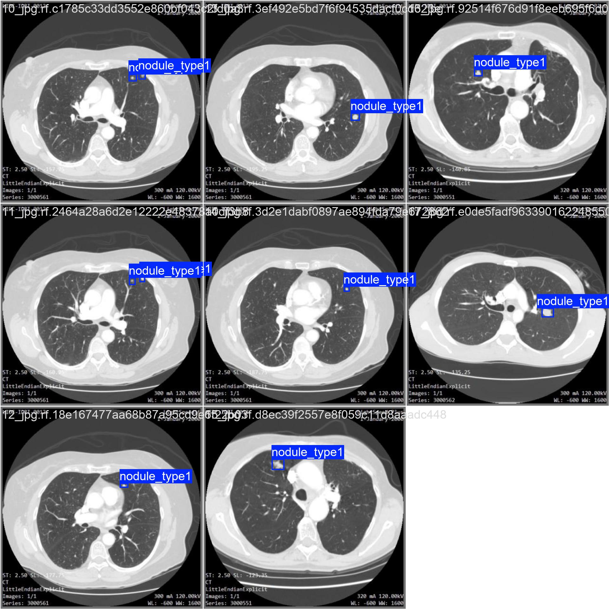
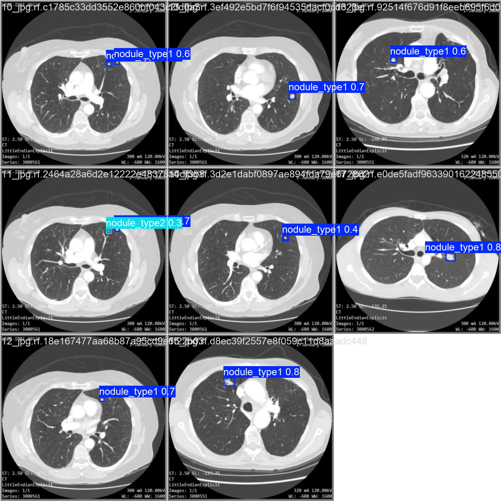

# YOLOv11 肺結節偵測
## 專案內容
肺結節偵測是肺癌早期篩檢的關鍵，難點在於結節目標很小，有些小於 3mm，在影像裡只佔幾個像素，很難偵測。而在這個資料集中，小結節除了樣本數較少，標註也較為寬鬆，這兩點都限制了模型對小結節的偵測精準度。


這個專案使用 YOLOv11 的影像辨識模型偵測肺結節。資料集是 Youness El Brag 在 Kaggle 提供的 Lung Nodules Detection Dataset Annotations，沿用 LIDC-IDRI 標準將腫瘤依大小分為兩類:第一類 >3mm，第二類 <=3mm。訓練集中兩類比例為 168:93，驗證集為 36:8。


為了更好的偵測 <=3mm 的肺結節，我做了一些調整:

1. 原圖為 416 x 416，插值放大到 1280 x 1280 並未增加影像資訊，但提高了 YOLO 偵測頭特徵圖的空間密度，讓只有幾個像素點的小結節在 YOLO 下採樣後的特徵空間能對應到更多特徵圖格點，讓模型更容易定位
2. 初始學習率 lr0=0.003、最終衰減至 lrf=0.01（初始的1％），讓模型前期穩定收斂，後期細修；並使用 AdamW optimizer 搭配 weight\_decay=0.0005 正則化，抑制小資料集過擬合
3. 資料增強：

   * mosaic=1.0 拼接多張圖片，增加場景多樣性
   * mixup=0.2 混合圖片，提升泛化能力
   * copy\_paste=0.3 複製貼上標註物件，增加結節出現次數
   * scale=0.5 隨機縮放，適應不同大小的腫瘤


### Detection Results

<p align="center">
  
  <span style="font-size: 30px; margin: 0 10px;">  </span>  

</p>
<p align="center">
  <em>Ground Truth (left) vs Prediction (right)</em>
</p>


## 資料集與專案架構
- 資料集 [Lung Nodules Dataset](https://www.kaggle.com/datasets/younesselbrag/lung-nodules-detection-dataset-annotations/data)  
- Image size: 416 × 416  
- Classes: `nodule > or =3 mm`, `nodule <3 mm` 
- Training set: 239 images  
- Validation set: 41 images  

```
ct_images/
├── images/
│   ├── train/
│   └── val/
├── labels/
│   ├── train/
│   └── val/
```

## 數據成果 (驗證集)


### 11l、11m、11s、11n 比對表格


|Model|Overall mAP50-95|<= 3mm mAP50-95|<= 3mm mAP75|
|-|-|-|-|
|11l (Large)|47.8%|34.5%|41.9%|
|11m (Medium)|46.9%|32.4%|11.0%|
|11s (Small)|53.7%|40.5%|33.8%|
|11n (Nano)|65.4%|57.5%|56.8%|

### yolov11n 模型數據

|Model|Precision|Recall|mAP50|mAP75|mAP50-95|
|-|-|-|-|-|-|
|YOLOv11n|85.4%|89.7%|89.8%|73.2%|65.4%|


詳細的分類情況如下:

|Class|Images|Instances|Precision|Recall|mAP50|mAP75|mAP50-95|
|-|-|-|-|-|-|-|-|
|all|41|44|85.4%|89.7%|89.8%|73.2%|65.4%|
|> 3mm|33|36|94.3%|97.2%|98.2%|89.5%|73.2%|
|<= 3mm|8|8|76.6%|82.1%|81.3%|56.8%|57.5%|
---

### 分析和討論

由數據可以發現，11l、11m 這類大模型在這個小資料集上表現較差（整體 mAP50-95 僅 46%～48%）。而小模型 11n 表現最好（65.4%）。推測是因為這個資料集比較小，因此使用大模型會導致過擬合；較小的模型泛化能力比較好。


在選模型的過程中觀察到不能只看單一指標。例如 11m 的小結節 mAP75 異常偏低至 11%，但它的小結節 mAP50-95（32.4%）其實與 11l 同級。主要原因是驗證集的小結節數量只有 8 個，只算單一指標 mAP75 波動很大；而 mAP50-95 是多個 IOU 門檻的平均，相對穩定。因此 mAP50-95 也是重要的參考依據。


11n 在四個模型中表現最好，尤其在小結節的預測上（由 11s mAP50-95 40.5% 提升至 11n mAP50-95 57.5%），顯示挑選合適的模型對小物件偵測影響很大。然而小結節的整體預測表現仍低於大結節。原因有兩個：其一是因為標註寬鬆，在 LIDC-IDRI 規範下，肺結節的標註由多位醫生獨立標註，細看原始標註發現標註的比較寬鬆，未精確貼合腫瘤，這使得模型難以學到高 IOU 的精準定位，這也是小結節 mAP50（81.3%） 和 mAP75（56.8%）落差較大的原因；其二是驗證集的小結節數量只有 8 個樣本，指標的參考性有限，容易受個別樣本影響波動較大。


在實務上會比較希望模型真的能找到有結節的位置，這也是肺癌早期篩檢的核心想法：不希望放過任何有可能的病灶。因此偏好比較高的 Recall。在 11n 的數據當中，也可以看到 Overall Recall 89.7% 代表在所有真實存在的結節中，模型成功抓出來的比例是 89.7%。本專案結果也不是一味的追求高 Recall，Overall Precision 仍有 85.4%，代表模型標示為結節的位置中，約 85.4% 確實是結節，誤報並不嚴重。


進一步觀察，在 11n 的數據裡，不管是 Overall / 大結節 / 小結節 Recall 都比 Precision 來的高。值得注意的是在小結節的情況，小結節的 Recall（82.1%）與 Precision（76.6%）差距達 5.5 個百分點，比 Overall（4.3）和大結節（2.9）都大。代表模型在小結節上「框錯」的情況相對更多，這也再次呼應前面提到的小結節難偵測、標註寬鬆、樣本少。


經過這些分析後，本專案的模型在應用上大方向是合理的，但是在小結節的預測上效果受限。目前的作法是 copy\_paste 全域增加樣本數，後續需要單獨補充小結節的資料，提高其數量與佔比，或是嘗試能容忍寬鬆標註的訓練法。
