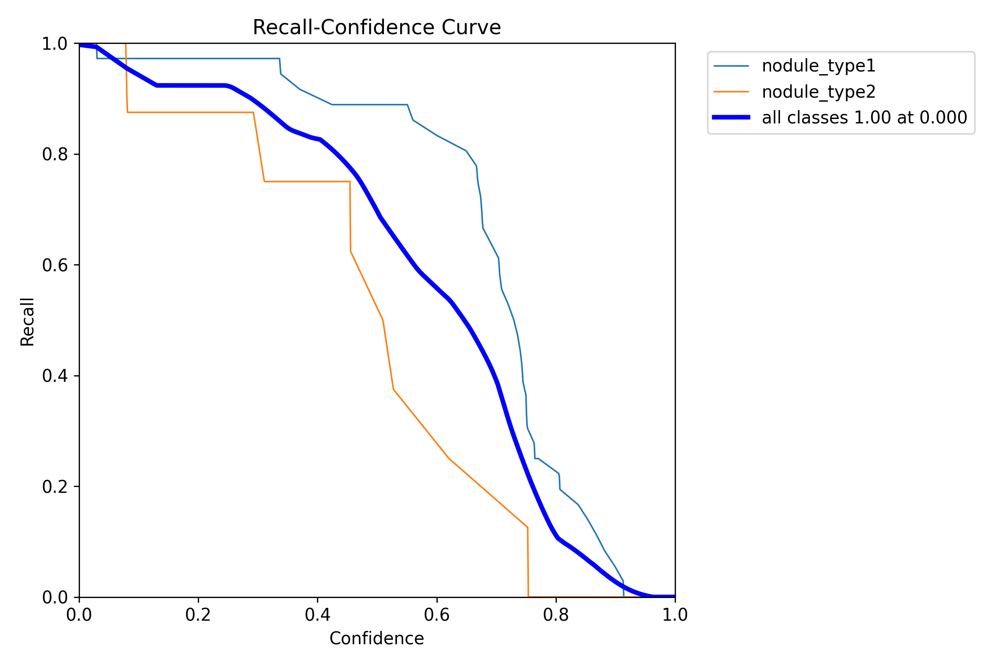
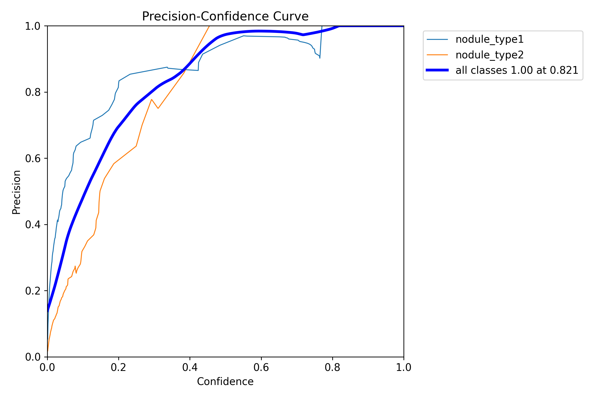
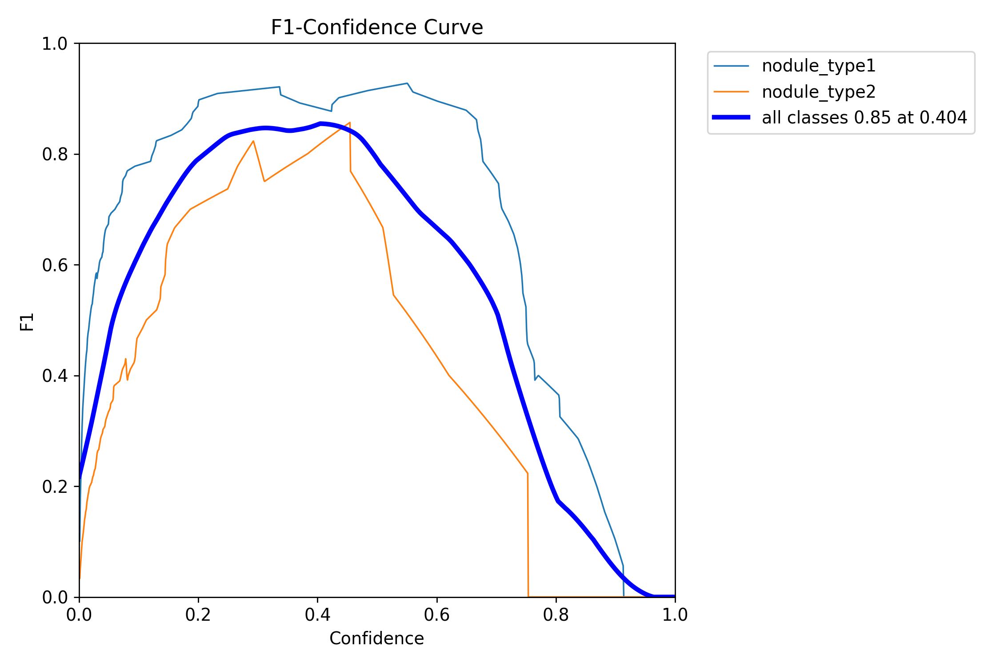
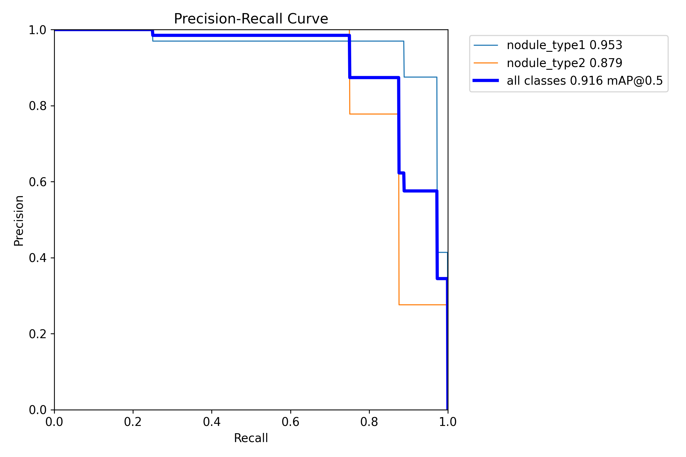

# Lung Nodules Detection
## Description
This project applies YOLOv11s for lung nodule detection in CT images, aiming to assist early lung cancer screening.

Due to the small size and subtle appearance of nodules, detection is challenging. 
To address this, the model is optimized for small object detection using high-resolution inputs and data augmentation techniques.

### Detection Results

<p align="center">
  
  <span style="font-size: 30px; margin: 0 10px;">  </span>  

</p>
<p align="center">
  <em>Ground Truth (left) vs Prediction (right)</em>
</p>


## Dataset
- Dataset: [Lung Nodules Dataset](https://www.kaggle.com/datasets/younesselbrag/lung-nodules-detection-dataset-annotations/data)  
- Image size: 416 × 416  
- Classes: `Nodule_type1`, `Nodule_type2`  
- Training set: 239 images  
- Validation set: 41 images  

The dataset is stored in the `ct_images` directory with the following structure:
```
ct_images/
├── images/
│   ├── train/
│   └── val/
├── labels/
│   ├── train/
│   └── val/
```

## Model

After comparing different models, **YOLOv11s** performs the best.

### Performance

| Model    | Precision | Recall | mAP50 | mAP75 | mAP50-95 |
|----------|-----------|--------|-------|-------|----------|
| YOLOv11s | 88.3%     | 82.5%  | 91.5% | 59.1% | 53.8%    |

### Metrics Explanation

- **Precision (88.3%)**  
  Among all predicted nodules, 88.3% are true positives (i.e., correctly detected nodules), while the remaining are false positives.  
  This indicates the model has a relatively low false positive rate.

- **Recall (82.5%)**  
  The model successfully detects 82.5% of all actual nodules.  
  The remaining 17.5% are missed detections (false negatives).

- **mAP50 (91.5%)**  
  Mean Average Precision at IoU = 0.5.  
  Indicates strong detection performance when moderate localization accuracy is acceptable.

- **mAP75 (59.1%)**  
  Mean Average Precision at IoU = 0.75.  
  Reflects stricter localization performance, showing that precise bounding box alignment is more challenging.

- **mAP50-95 (53.8%)**  
  Averaged mAP across IoU thresholds from 0.5 to 0.95.  
  Provides a comprehensive evaluation of both detection and localization performance.


<p align="center">
  
  
</p>

<p align="center">
  
  
</p>


## Training Configuration

The model is trained with the following hyperparameters:

### Training Settings
- **epochs = 150**  
  Number of training epochs. A relatively high value ensures sufficient convergence.

- **imgsz = 1280**  
  High-resolution input to capture small nodules more effectively, which is critical in medical imaging.

---

### Optimization
- **optimizer = AdamW**  
  Adaptive optimizer with decoupled weight decay, providing stable convergence.

- **lr0 = 0.003**  
  Initial learning rate.

- **lrf = 0.01**  
  Final learning rate factor for cosine decay scheduling.

- **weight_decay = 0.0005**  
  Regularization to prevent overfitting.

---

### Loss Weights
- **box = 7.0**  
  Emphasizes bounding box regression accuracy.

- **cls = 0.5**  
  Lower weight since classification is relatively simple (only 2 classes).

- **dfl = 1.8**  
  Distribution Focal Loss weight for better localization precision.

---

### Data Augmentation
- **mosaic = 1.0**  
  Strong augmentation to improve generalization and small object detection.

- **mixup = 0.2**  
  Blends images to improve robustness.

- **copy_paste = 0.3**  
  Helps increase object diversity, useful for small datasets.

- **scale = 0.5**  
  Random scaling for better scale invariance.

---

### Performance Optimization
- **cache = "ram"**  
  Loads dataset into memory for faster training.

- **batch = -1**  
  Automatically selects the largest possible batch size.

- **workers = 2**  
  Number of data loading workers (limited by hardware).

---

